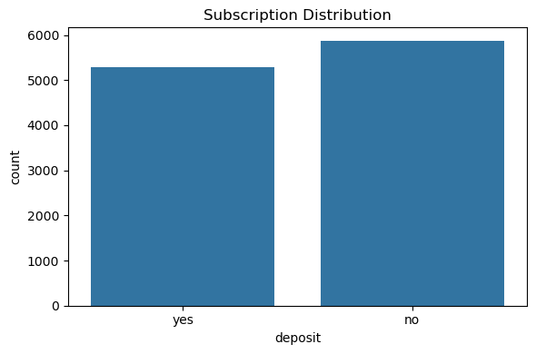
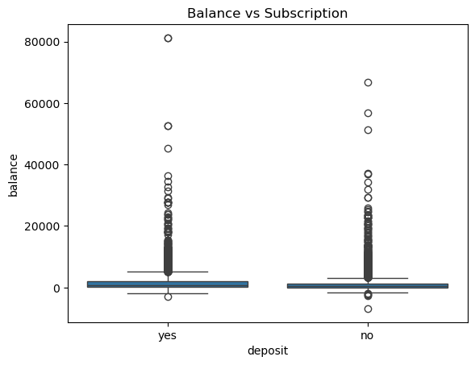

# Predictive Bank Marketing Analysis

## Problem

Banks run large marketing campaigns, but most customer contacts do not convert.
The goal of this project is to identify **which customers are most likely to subscribe** to a term deposit and uncover **key drivers of conversion**.

---

##  Key Insights

* Customers with **higher account balances** show significantly higher conversion rates
* **Previous campaign success** is the strongest predictor of subscription
* Conversion varies across **job categories**, revealing segmentation opportunities
* Campaign timing (month) impacts effectiveness

---

##  Visual Evidence

### Subscription Distribution



The dataset is relatively balanced, meaning prediction is not biased toward one class.

---

### Subscription Rate by Job


Conversion rates differ across job categories, indicating behavioral segmentation opportunities.

---

### Balance vs Subscription



Customers who subscribe tend to have higher balances, suggesting financial capacity is a key driver.

---

##  Approach

* Performed exploratory data analysis (EDA) using Python (Pandas, Seaborn)
* Built a **Logistic Regression model (~81% accuracy)**
* Identified and interpreted key features driving conversion
* Translated findings into business-relevant insights

---

## Business Impact

* Enables targeted outreach to high-probability customers
* Reduces wasted marketing spend
* Improves campaign efficiency through data-driven decision making

---

##  Tools

Python, Pandas, NumPy, Seaborn, Matplotlib, Scikit-learn

---

##  How to Run

````bash
pip install pandas numpy matplotlib seaborn scikit-learn
```

Open the notebook in VS Code or Jupyter and run all cells.
