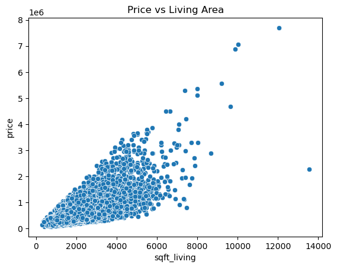

# King County House Price Prediction

## Overview
This project predicts house prices in King County, Washington using a regression model. The goal is to understand which features drive property value and build a baseline model for price prediction.

---

## Dataset
- 21,613 house sales (King County, WA)
- Features include size, condition, quality, and structural attributes
- Target variable: **price**

---

## Exploratory Data Analysis

### Price Distribution

s
- Prices are right-skewed with a few high-value outliers
- Most homes fall within mid-range price levels

---

### Price vs Living Area

- Strong positive relationship between square footage and price
- Larger homes tend to have significantly higher prices

---

### Correlation Heatmap

- Strong correlations:
  - sqft_living
  - grade
  - bathrooms
- These features are key drivers of house prices

---

## Model

### Linear Regression
- Built a baseline regression model using scikit-learn
- Trained on 80% of data, tested on 20%

---

## Model Performance
- **RMSE:** ~228,000  
- **R² Score:** ~0.65  

The model explains about 65% of the variation in house prices and provides a solid baseline.

---

## Key Insights
- Square footage is the strongest predictor of price
- Property quality (grade) significantly impacts value
- Housing prices show high variability and skewness

---

## Business Value
- Can estimate house prices based on property features
- Useful for real estate pricing and investment decisions
- Helps identify which features add the most value

---

## Limitations
- Linear model cannot capture complex relationships
- Sensitive to outliers and skewed distributions

---

## Future Improvements
- Use Random Forest or Gradient Boosting
- Apply feature transformations (log(price))
- Engineer new features (location clusters, age of house)

---

## Tools Used
- Python (Pandas, NumPy)
- Scikit-learn
- Matplotlib & Seaborn