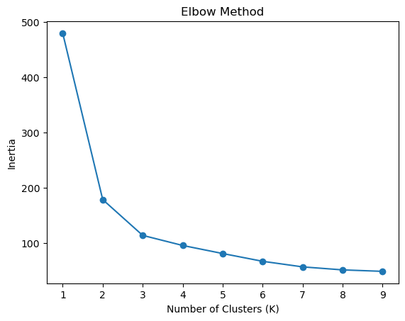
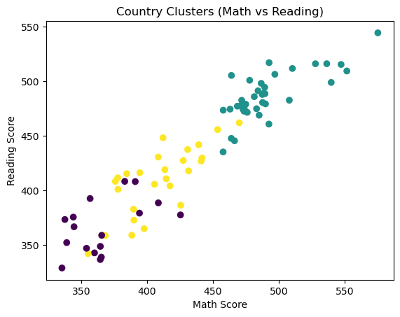
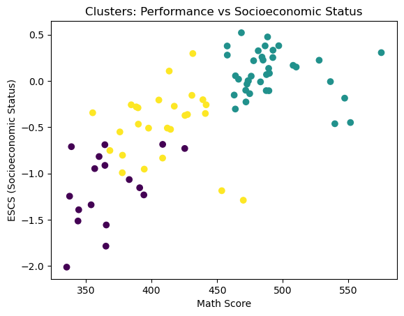

---

## Author
Tanner M. Yochum  
Data Science & Machine Learning

# Global Education Patterns: Clustering Countries by Performance and Socioeconomic Factors

## Overview
This project uses unsupervised learning (K-Means clustering) to group countries based on educational performance and socioeconomic indicators.

The goal is to identify patterns between academic outcomes and access to resources across countries.

---

## Dataset
- Source: PISA 2022 (OECD)
- Observations: ~80 countries
- Features:
  - Academic performance: math, reading, science
  - Socioeconomic indicators: ESCS (economic index)
  - Technology access: internet, computer availability

---

## Methodology

### 1. Data Preparation
- Removed unnecessary identifiers
- Selected relevant numerical features
- Standardized features using StandardScaler

### 2. Clustering Approach
- Used K-Means clustering
- Determined optimal clusters using the Elbow Method
- Applied clustering to scaled data

### 3. Visualization
- Scatter plot (price vs features equivalent → here performance relationships)
- Cluster visualization
- Feature correlation heatmap

---
## Visualizations

### Elbow Method (Optimal Clusters)
Used to determine the optimal number of clusters for K-Means.

---

### Cluster Visualization
Shows how countries group based on standardized educational and socioeconomic features.

---

### Cluster Separation (Alternative View)
Provides another perspective on how clusters are distributed.

---

## Key Insights

- Countries naturally group into **high, mid, and low performance clusters**
- Higher-performing countries consistently have:
- Better internet access
- Greater computer availability
- Higher socioeconomic indicators

- Lower-performing countries show limited access to these resources

This highlights a strong relationship between **education outcomes and resource accessibility**

---

## Conclusion

Educational performance is not isolated — it is strongly influenced by socioeconomic conditions and access to technology.

This analysis demonstrates how clustering can uncover global inequality patterns and provide insights for policy and educational improvement.

---

## Tools Used
- Python (pandas, numpy)
- scikit-learn (KMeans, StandardScaler)
- matplotlib / seaborn

---
